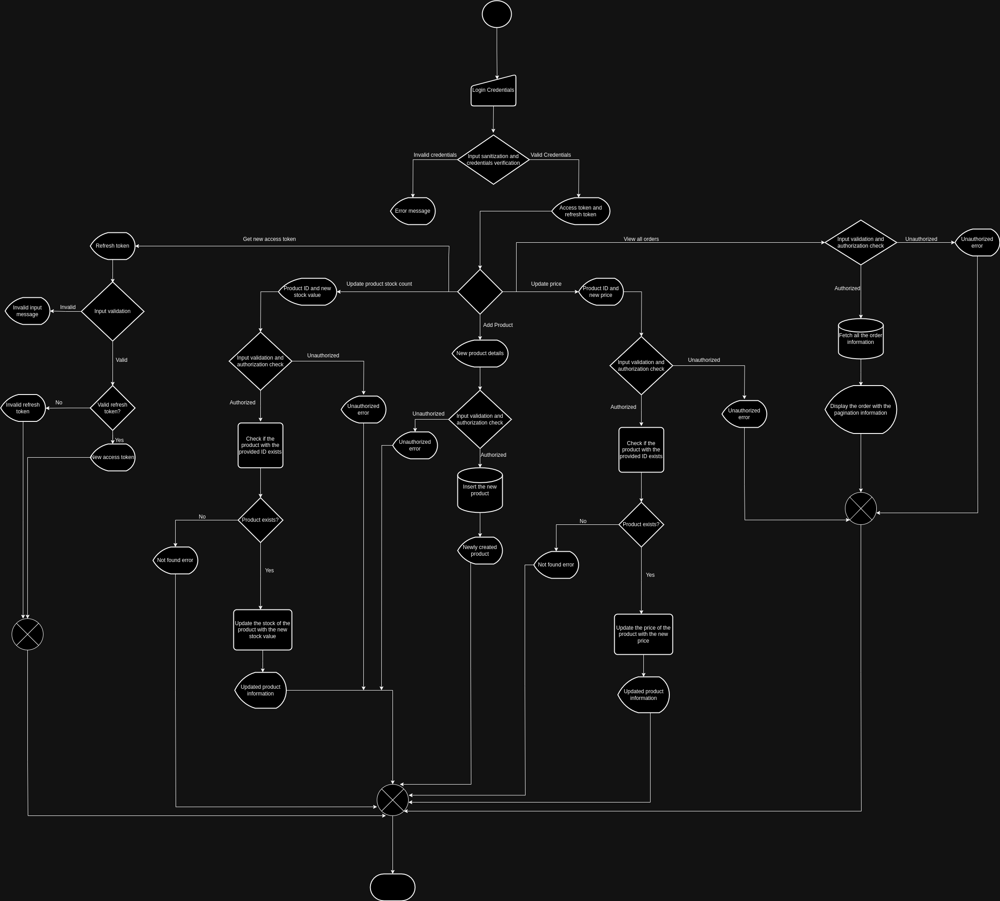
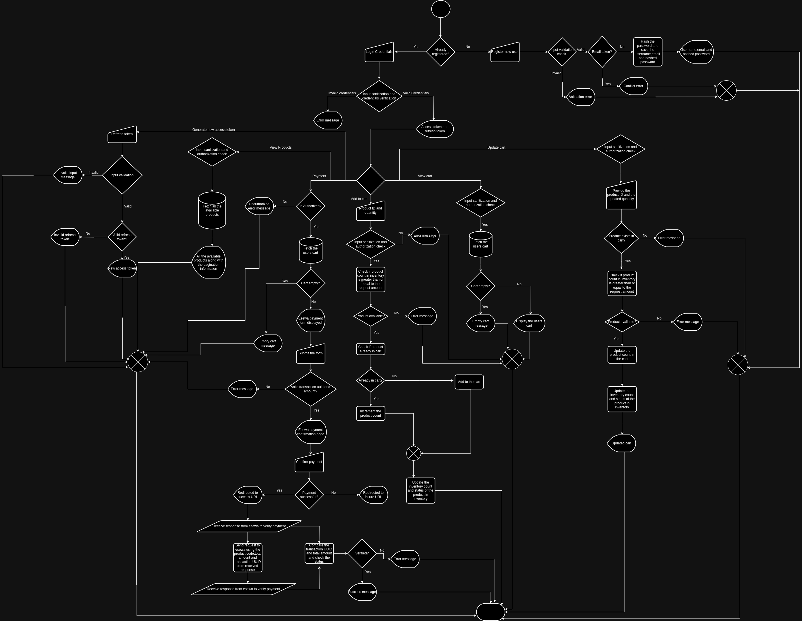

---

# E-Commerce API

An e-commerce platform built using Node.js and PostgreSQL, supporting various functionalities such as user authentication, product management, shopping cart, and payment integration using eSewa. This API serves as the backend for an e-commerce application and includes JWT-based user authentication, CRUD operations, and secure payment processing.

## Table of Contents

1. [Features](#features)
2. [System Diagram](#system-diagram)
3. [Tech Stack](#tech-stack)
4. [Requirements](#requirements)
5. [Installation](#installation)
6. [Environment Variables](#environment-variables)
7. [Running the Project](#running-the-project)
8. [API Endpoints](#api-endpoints)
9. [Admin Functionalities](#admin-functionalities)
10. [Payment Integration](#payment-integration)
11. [License](#license)

## Features

- **User Authentication**: Sign up, log in, and token-based authentication using JWT.
- **Product Management**: Add, update, delete, and view products.
- **Shopping Cart**: Users can add, view, update, and remove products in their shopping cart.
- **Product Search**: Search and filter products by category, name, and price.
- **Checkout and Payment**: Users can checkout and pay for products using eSewa.
- **Admin Panel**: Admin users can manage products and inventory.
- **Order Management**: Users can view their past orders and check order status.

## System Diagram
- **Ecommerce API Admin Flow**: 


- **Ecommerce API User Flow**: 



## Tech Stack

- **Node.js**: JavaScript runtime for building server-side applications.
- **Express.js**: Web framework for creating API routes.
- **PostgreSQL**: SQL database for managing data.
- **JWT**: Secure authentication for users.
- **eSewa**: Payment gateway integration for processing transactions.
- **Knex**: SQL query builder for interacting with the PostgreSQL database.
- **Joi**: Schema validation for request bodies, headers, and query parameters.
- **Rate Limiter**: To prevent brute-force attacks and abuse of the API by limiting the number of requests.
- **Helmet**: Security middleware to set various HTTP headers and protect against common vulnerabilities.

## Requirements

- Node.js (version 14 or later)
- PostgreSQL (version 12 or later)
- NPM or Yarn
- Git

## Installation

1. **Clone the Repository**:
   ```bash
   git clone https://github.com/jayan058/ecommerceAPI.git
   cd ecommerceAPI
   ```

2. **Install Dependencies**:
   ```bash
   npm install
   ```

3. **Setup PostgreSQL Database**:  
   Create a new database named `ecommerce_db` (or your preferred name) in PostgreSQL.

4. **Configure Environment Variables**:  
   Create a `.env` file in the root directory using the template below.

## Environment Variables

Create a `.env` file in the root of your project and add the following environment variables:

```plaintext
# Server Configuration
PORT=your_port_number

# Database Configuration
DB_CLIENT=pg
DB_HOST=localhost
DB_PORT=5432
DB_USER=postgres
DB_PASSWORD=your_db_password
DB_NAME=ecommerce_db

# JWT Secret
JWT_SECRET=your_jwt_secret

# eSewa Configuration
ESEWA_SECRET_KEY=your_esewa_secret_key
ESEWA_SUCCESS_URL=your_success_url_if_payment_is_successful
ESEWA_FAILURE_URL=your_failure_url_if_payment_fails
ESEWA_PAYMENT_VERIFY_URL=https://uat.esewa.com.np/api/epay/transaction/status/?product_code=${your_product_code}&total_amount=${total_amount}&transaction_uuid=${your_transaction_uuid}
```


## Running the Project

1. **Start the Server**:
   ```bash
   npm start
   ```

2. The server should be running on [http://localhost:your_port_number](http://localhost:your_port_number).


---

## API Endpoints

### Authentication

- **POST /user**  
  Register a new user.  
  - **Request Body**:
    ```json
    {
      "userName": "John Doe",
      "email": "johndoe@example.com",
      "password": "yourpassword"
    }
    ```
  - **Response**:
    ```json
    {
     "name": "John Doe",
     "email": "johndoe@example.com",
     "password": "$2b$10$SfR37id3roGZdMMWcOqwYuJ3ZxDWvdsSrAixqhnVzc3FKOt2Lunf2"
    }
  - **Response (If email already taken)**:
    ```json
    {
      "status": "error",
      "statusCode": 409,
      "message": "Email already taken"
     }

    ```
  - **Authorization**: Public (No authentication required)

---

- **POST /login**  
  Login to get a JWT token.  
  - **Request Body**:
    ```json
    {
       "email": "johndoe@example.com",
      "password": "yourpassword"    
     }
    ```
  - **Response**:
    ```json
    {
     "accessToken":    your_access_token,
      "refreshToken":  your_refresh_token
    }
    ```
  - **Response (If wrong password)**:
    ```json
    {
     "status": "error",
     "statusCode": 401,
     "message": "Passwords Don't Match"
     }
    ```
  - **Response (If invalid email format is provided)**:
     ```json
    {
     "status": "error",
     "statusCode": 400,
     "message": "Please provide a valid email address."
     }
    ```
   - **Response (If wrong email)**:
      ```json
     {
     "status": "error",
     "statusCode": 404,
     "message": "No Matching Email"
     }

    ```
 - **Authorization**: Public (No authentication required)

---

### Product Management

- **GET /products**  
  Get a list of all products. Supports filters using query parameters such as `name`, `brand`, `priceRange`, `category`, `page`, and `limit`.  
  - **Example Request**:
    ```
    GET http://localhost:3000/product?name=Sample%20Product&brand=Sample%20Brand&priceRange=0,100&category=Sample%20Category&page=3&limit=1
    ```
  - **Response**:
    ```json
    {
    "products": [
    {
      "id": "3",
      "name": "Sample Product",
      "brand": "Sample Brand",
      "category": "Sample Category",
      "price": "69.99",
      "inventoryCount": 81,
      "description": "This is a sample product description.",
      "isActive": true,
      "createdAt": "2024-10-01T11:15:57.697Z",
      "updatedAt": "2024-10-02T03:32:36.604Z"
    }
    ],
    "pagination": {
    "totalCount": "6",
    "totalPages": 6,
    "currentPage": 3,
    "limit": 1
     }
    }
    ```
  - **Response (If negative price range is provided)**:
    ```json
    {
    "status": "error",
     "statusCode": 400,
     "message": "Price range must be in the format 'minPrice,maxPrice' with non-negative 
      numbers."
    }
    ```
  - **Response (If negative limit or page is provided)**:
    ```json
    {
    "status": "error",
    "statusCode": 400,
    "message": "Page must be a positive number."
    }
    ```
    ```json
    {
    "status": "error",
    "statusCode": 400,
    "message": "Limit must be a positive number."
    }
    ```
    
  - **Authorization**: User only (**Admin is forbidden**)

---

- **POST /products**  
  Add a new product. (Admin only)  
  - **Request Body**:
    ```json
    {
     "name": "Sample Product",
     "brand": "Sample Brand",
     "category": "Sample Category",
     "price": 69.99,
     "inventory_count": "90",
     "description": "This is a sample product description."
     }
    ```
  - **Response**:
    ```json
    {
     "success": true,
     "message": "Product added successfully",
     "newProduct": {
         "name": "Sample Product",
         "brand": "Sample Brand",
         "category": "Sample Category",
         "price": 69.99,
         "inventory_count": "90",
         "description": "This is a sample product description.",
         "created_at": "2024-10-02T10:10:36.723Z"
     }
    }
    ```
   - **Response (If any field other than description is missing)**:
     ```json
     {
        "status": "error",
        "statusCode": 400,
        "message": "Inventory count is required."
      }
    ```
 - **Authorization**: **Admin only**

---

- **PUT product/:id/update-price**  
  Update a product price
  - **Request Body**:
    ```json
    {
    "newPrice": 2
    }
    ```
  - **Response**:
    ```json
    {
     "success": true,
     "message": "Price updated successfully",
     "updatedProduct": {
        "id": "5",
        "name": "Sample Product",
        "brand": "Sample Brand",
        "category": "Sample Category",
        "price": 2,
        "inventoryCount": 90,
        "description": "This is a sample product description.",
        "isActive": true,
        "createdAt": "2024-10-01T11:15:58.004Z",
        "updatedAt": "2024-10-01T11:15:58.005Z"
     }
    }
    ```
 
  - **Response (If product with the given id is not found)**:
    ```json
    {
       "status": "error",
      "statusCode": 404,
      "message": "Product with ID 900 not found"
    }
    ```
  - **Response (If invalid product id is provided)**:
    ```json
    {
    "status": "error",
    "statusCode": 400,
    "message": "Product id must be a positive number."
    }
    ```
  - **Response (If incomplete input is provided)**:
    ```json
    {
    "status": "error",
    "statusCode": 400,
    "message": "New price is required."
    }
    ```
- **Authorization**: **Admin only**
---


- **PUT product/:id/update-stock**  
  Update a product price
  - **Request Body**:
    ```json
    {
    "newStock": 2
    }
    ```
  - **Response**:
    ```json
    {
     "success": true,
     "message": "Product stock updated successfully",
     "updatedProduct": {
        "id": "5",
        "name": "Sample Product",
        "brand": "Sample Brand",
        "category": "Sample Category",
        "price": 2,
        "inventoryCount": 0,
        "description": "This is a sample product description.",
        "isActive": false,
        "createdAt": "2024-10-01T11:15:58.004Z",
        "updatedAt": "2024-10-01T11:15:58.005Z"
     }
    }
    ```
 
  - **Response (If product with the given id is not found)**:
    ```json
    {
       "status": "error",
      "statusCode": 404,
      "message": "Product with ID 900 not found"
    }
    ```
  - **Response (If invalid product id is provided)**:
    ```json
    {
    "status": "error",
    "statusCode": 400,
    "message": "Product id must be a positive number."
    }
    ```
  - **Response (If incomplete input is provided)**:
    ```json
    {
    "status": "error",
    "statusCode": 400,
    "message": "New stock count is required."
    }
    ```
- **Authorization**: **Admin only**
---

- **GET /cart**  
  View items in the cart. No request body required.  
  - **Response**:
    ```json
    [
     { 
    "id": "3",
    "name": "Sample Product",
    "brand": "Sample Brand",
    "category": "Sample Category",
    "quantity": 9,
    "price": "69.99"
     } 
    ]
    ```
  - **Response (If the cart is empty)**:
    ```json
    
    { 
    "status": "error",
    "statusCode": 404,
    "message": "The cart is empty."
    } 
    
    ```
  - **Authorization**: **User Only (Not Admin)**

---

- **DELETE /cart/:productId**  
  Remove a product from the cart.  
  - **Example Request**:
    ```
    DELETE http://localhost:3000/cart/3
    ```
  - **Response**:
    ```json
    {
     "success": true,
     "message": "Product removed from cart successfully."
    }
    ```
  - **Response (If the product with the given id does not exist in the cart)**:
    ```json
    {
    "status": "error",
    "statusCode": 400,
    "message": "Error deleting product from cart: Product with id 3 not found in the cart"
    }
    ```

  - **Authorization**: **User Only (Not Admin)**

---


- **POST /cart/**  
  Add product to cart  
  - **Request-Body**:
    ```json
    {
     "productId":3,
     "quantity":9
    }
    ```
  - **Response**:
    ```json
    [
      {
    "id": "3",
    "name": "Sample Product",
    "brand": "Sample Brand",
    "category": "Sample Category",
    "quantity": 9
      }
    ]
    ```
  - **Response (If the desired amount is not avaiable in the inventory)**:
    ```json
    {
    "status": "error",
    "statusCode": 400,
    "message": "Your desired quantity exceeds our available stock"
    }
    ```
  - **Response (If the provided productId is wrong)**:
    ```json
    {
    "status": "error",
    "statusCode": 404,
    "message": "Product with id:99 not found"
    }
    ```
  - **Response (If the provided productId is invalid)**:
    ```json
    {
    "status": "error",
    "statusCode": 400,
    "message": "Product ID must be a positive number."
    }
    ```

  - **Authorization**: **User Only (Not Admin)**

---

- **PUT /cart/:productId**  
 Update the product quantity in the cart 
  - **Request-Body**:
    ```json
    {
     "quantity":10
     }
    ```
  - **Response**:
    ```json
    [
     {
    "id": "3",
    "name": "Sample Product",
    "brand": "Sample Brand",
    "category": "Sample Category",
    "quantity": 10,
    "price": "69.99"
     }
    ]
    ```

  - **Response (If the provided productId is not present in the cart)**:
    ```json
    {
     "status": "error",
     "statusCode": 404,
     "message": "Product with id:99 not found"
    }
    ```
  - **Response (If the provided quantity is negative)**:
    ```json
    {
     "status": "error",
     "statusCode": 400,
     "message": "Quantity cannot be negative. Use zero (0) to remove the item from the cart."
    }
    ```
  - **Response (If the provided productId is invalid)**:
    ```json
    {
     "status": "error",
     "statusCode": 400,
     "message": "Product id must be a positive number."
    }
    ```

  - **Authorization**: **User Only (Not Admin)**

---
### Order and Payment

- **POST payment/checkout**  
  Checkout the cart and initiate payment using eSewa.  
 - **Authorization**: User

---

- **POST /payment/success/:userId (Redirected to this URL if the payment is successful)**  
  Verify eSewa payment status. 
- **Response**: Esewa sends this response if the payment is successful.
 ``` 
eyJ0cmFuc2FjdGlvbl9jb2RlIjoiMExENUNFSCIsInN0YXR1cyI6IkNPTVBMRVRFIiwidG90YWxfYW1vdW50IjoiMSwwMDAuMCIsInRyYW5zYWN0aW9uX3V1aWQiOiIyNDA2MTMtMTM0MjMxIiwicHJvZHVjdF9jb2RlIjoiTlAtRVMtQUJISVNIRUstRVBBWSIsInNpZ25lZF9maWVsZF9uYW1lcyI6InRyYW5zYWN0aW9uX2NvZGUsc3RhdHVzLHRvdGFsX2Ftb3VudCx0cmFuc2FjdGlvbl91dWlkLHByb2R1Y3RfY29kZSxzaWduZWRfZmllbGRfbmFtZXMiLCJzaWduYXR1cmUiOiJNcHd5MFRGbEhxcEpqRlVER2ljKzIybWRvZW5JVFQrQ2N6MUxDNjFxTUFjPSJ9
```
- **Response (Decode the above Base64 response to obatin the following)**:
    ```json
    {
  "transaction_code": "0LD5CEH",
  "status": "COMPLETE",
  "total_amount": "1,000.0",
  "transaction_uuid": "240613-134231",
  "product_code": "NP-ES-ABHISHEK-EPAY",
  "signed_field_names": 
   "transaction_code,status,total_amount,transaction_uuid,product_code,signed_field_names",
  "signature": "Mpwy0TFlHqpJjFUDGic+22mdoenITT+Ccz1LC61qMAc="
   } 
    ```
   
 - **Authorization**: None

---


## Payment Integration

This application integrates with eSewa for payment processing. The `verifyEsewaPayment` function is used to validate and verify payments with eSewa. Make sure to configure your `ESEWA_SECRET_KEY`, `ESEWA_SUCCESS_URL`, and `ESEWA_FAILURE_URL` correctly in the environment variables.

### eSewa Payment Flow:

1. User initiates a payment on the `/payment/checkout` route.
2. The API redirects the user to eSewa's payment gateway.
3. Once the payment is completed, eSewa sends a response back to the `/success/:userId` route.
4. The API verifies the payment by and if the payment is successful then a new order is created in the database.


---
